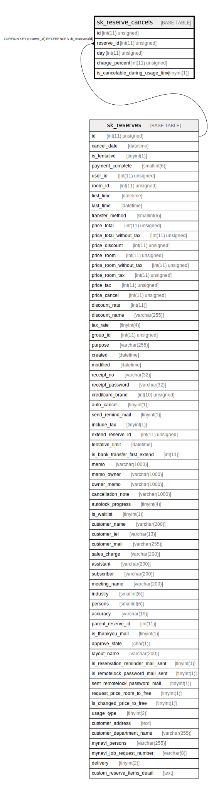

# sk_reserve_cancels

## Description

予約時のキャンセル割合

<details>
<summary><strong>Table Definition</strong></summary>

```sql
CREATE TABLE `sk_reserve_cancels` (
  `id` int(11) unsigned NOT NULL AUTO_INCREMENT,
  `reserve_id` int(11) unsigned NOT NULL COMMENT '予約ID',
  `day` int(11) unsigned NOT NULL COMMENT '利用日から何日前のキャンセルか',
  `charge_percent` int(11) unsigned NOT NULL COMMENT 'キャンセルの割合',
  `is_cancelable_during_usage_time` tinyint(1) DEFAULT '0',
  PRIMARY KEY (`id`),
  KEY `sk_relation_reserve_and_cancels` (`reserve_id`),
  CONSTRAINT `sk_relation_reserve_and_cancels` FOREIGN KEY (`reserve_id`) REFERENCES `sk_reserves` (`id`) ON DELETE CASCADE ON UPDATE CASCADE
) ENGINE=InnoDB AUTO_INCREMENT=[Redacted by tbls] DEFAULT CHARSET=utf8 COMMENT='予約時のキャンセル割合'
```

</details>

## Columns

| Name | Type | Default | Nullable | Extra Definition | Children | Parents | Comment |
| ---- | ---- | ------- | -------- | ---------------- | -------- | ------- | ------- |
| id | int(11) unsigned |  | false | auto_increment |  |  |  |
| reserve_id | int(11) unsigned |  | false |  |  | [sk_reserves](sk_reserves.md) | 予約ID |
| day | int(11) unsigned |  | false |  |  |  | 利用日から何日前のキャンセルか |
| charge_percent | int(11) unsigned |  | false |  |  |  | キャンセルの割合 |
| is_cancelable_during_usage_time | tinyint(1) | 0 | true |  |  |  |  |

## Constraints

| Name | Type | Definition |
| ---- | ---- | ---------- |
| PRIMARY | PRIMARY KEY | PRIMARY KEY (id) |
| sk_relation_reserve_and_cancels | FOREIGN KEY | FOREIGN KEY (reserve_id) REFERENCES sk_reserves (id) |

## Indexes

| Name | Definition |
| ---- | ---------- |
| sk_relation_reserve_and_cancels | KEY sk_relation_reserve_and_cancels (reserve_id) USING BTREE |
| PRIMARY | PRIMARY KEY (id) USING BTREE |

## Relations



---

> Generated by [tbls](https://github.com/k1LoW/tbls)
