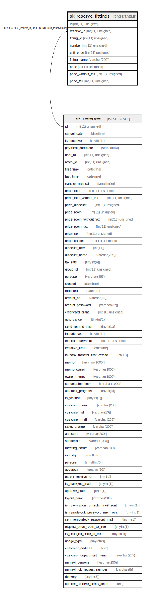

# sk_reserve_fittings

## Description

予約した室内備品

<details>
<summary><strong>Table Definition</strong></summary>

```sql
CREATE TABLE `sk_reserve_fittings` (
  `id` int(11) unsigned NOT NULL AUTO_INCREMENT COMMENT 'id',
  `reserve_id` int(11) unsigned NOT NULL,
  `fitting_id` int(11) unsigned NOT NULL COMMENT '室内備品ID',
  `number` int(11) unsigned NOT NULL COMMENT '使用個数',
  `unit_price` int(11) unsigned NOT NULL COMMENT '予約時の単価',
  `fitting_name` varchar(200) NOT NULL DEFAULT '' COMMENT '予約時の備品名称',
  `price` int(11) unsigned NOT NULL COMMENT '各備品の請求金額',
  `price_without_tax` int(11) unsigned NOT NULL COMMENT '各備品の請求金額（税抜）',
  `price_tax` int(11) unsigned NOT NULL COMMENT '各備品の消費税代',
  PRIMARY KEY (`id`),
  KEY `sk_relation_reserve_and_fittings` (`reserve_id`),
  CONSTRAINT `sk_relation_reserve_and_fittings` FOREIGN KEY (`reserve_id`) REFERENCES `sk_reserves` (`id`) ON DELETE CASCADE ON UPDATE CASCADE
) ENGINE=InnoDB AUTO_INCREMENT=[Redacted by tbls] DEFAULT CHARSET=utf8 COMMENT='予約した室内備品'
```

</details>

## Columns

| Name | Type | Default | Nullable | Extra Definition | Children | Parents | Comment |
| ---- | ---- | ------- | -------- | ---------------- | -------- | ------- | ------- |
| id | int(11) unsigned |  | false | auto_increment |  |  | id |
| reserve_id | int(11) unsigned |  | false |  |  | [sk_reserves](sk_reserves.md) |  |
| fitting_id | int(11) unsigned |  | false |  |  |  | 室内備品ID |
| number | int(11) unsigned |  | false |  |  |  | 使用個数 |
| unit_price | int(11) unsigned |  | false |  |  |  | 予約時の単価 |
| fitting_name | varchar(200) |  | false |  |  |  | 予約時の備品名称 |
| price | int(11) unsigned |  | false |  |  |  | 各備品の請求金額 |
| price_without_tax | int(11) unsigned |  | false |  |  |  | 各備品の請求金額（税抜） |
| price_tax | int(11) unsigned |  | false |  |  |  | 各備品の消費税代 |

## Constraints

| Name | Type | Definition |
| ---- | ---- | ---------- |
| PRIMARY | PRIMARY KEY | PRIMARY KEY (id) |
| sk_relation_reserve_and_fittings | FOREIGN KEY | FOREIGN KEY (reserve_id) REFERENCES sk_reserves (id) |

## Indexes

| Name | Definition |
| ---- | ---------- |
| sk_relation_reserve_and_fittings | KEY sk_relation_reserve_and_fittings (reserve_id) USING BTREE |
| PRIMARY | PRIMARY KEY (id) USING BTREE |

## Relations



---

> Generated by [tbls](https://github.com/k1LoW/tbls)
