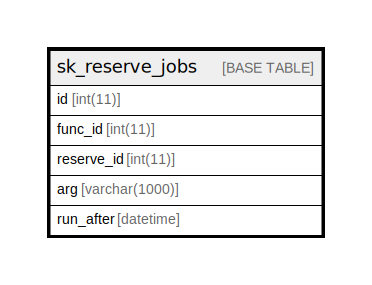

# sk_reserve_jobs

## Description

予約送信用ジョブデータ

<details>
<summary><strong>Table Definition</strong></summary>

```sql
CREATE TABLE `sk_reserve_jobs` (
  `id` int(11) NOT NULL AUTO_INCREMENT,
  `func_id` int(11) NOT NULL COMMENT 'ジョブの識別子',
  `reserve_id` int(11) NOT NULL COMMENT '予約ID',
  `arg` varchar(1000) NOT NULL DEFAULT '' COMMENT '引数',
  `run_after` datetime DEFAULT NULL COMMENT '実行時間、NULLは実行しない',
  PRIMARY KEY (`id`)
) ENGINE=InnoDB AUTO_INCREMENT=[Redacted by tbls] DEFAULT CHARSET=utf8 COMMENT='予約送信用ジョブデータ'
```

</details>

## Columns

| Name | Type | Default | Nullable | Extra Definition | Children | Parents | Comment |
| ---- | ---- | ------- | -------- | ---------------- | -------- | ------- | ------- |
| id | int(11) |  | false | auto_increment |  |  |  |
| func_id | int(11) |  | false |  |  |  | ジョブの識別子 |
| reserve_id | int(11) |  | false |  |  |  | 予約ID |
| arg | varchar(1000) |  | false |  |  |  | 引数 |
| run_after | datetime |  | true |  |  |  | 実行時間、NULLは実行しない |

## Constraints

| Name | Type | Definition |
| ---- | ---- | ---------- |
| PRIMARY | PRIMARY KEY | PRIMARY KEY (id) |

## Indexes

| Name | Definition |
| ---- | ---------- |
| PRIMARY | PRIMARY KEY (id) USING BTREE |

## Relations



---

> Generated by [tbls](https://github.com/k1LoW/tbls)
