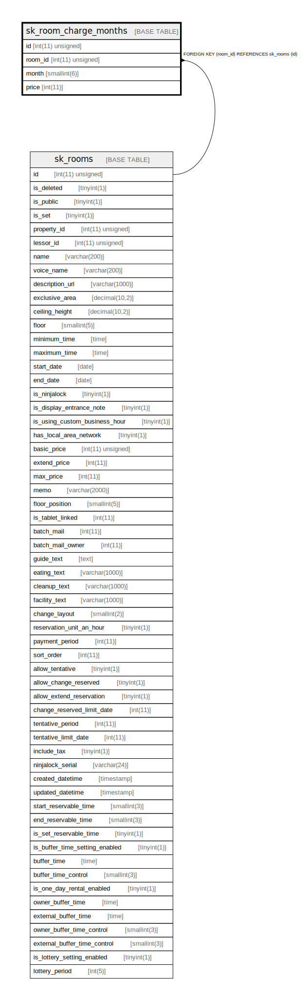

# sk_room_charge_months

## Description

月毎の利用料調整

<details>
<summary><strong>Table Definition</strong></summary>

```sql
CREATE TABLE `sk_room_charge_months` (
  `id` int(11) unsigned NOT NULL AUTO_INCREMENT COMMENT 'id',
  `room_id` int(11) unsigned NOT NULL,
  `month` smallint(6) NOT NULL COMMENT '月',
  `price` int(11) NOT NULL DEFAULT '0' COMMENT '値段の増減',
  PRIMARY KEY (`id`),
  KEY `sk_relation_room_charge_months_and_rooms` (`room_id`),
  CONSTRAINT `sk_relation_room_charge_months_and_rooms` FOREIGN KEY (`room_id`) REFERENCES `sk_rooms` (`id`) ON DELETE CASCADE ON UPDATE CASCADE
) ENGINE=InnoDB AUTO_INCREMENT=[Redacted by tbls] DEFAULT CHARSET=utf8 COMMENT='月毎の利用料調整'
```

</details>

## Columns

| Name | Type | Default | Nullable | Extra Definition | Children | Parents | Comment |
| ---- | ---- | ------- | -------- | ---------------- | -------- | ------- | ------- |
| id | int(11) unsigned |  | false | auto_increment |  |  | id |
| room_id | int(11) unsigned |  | false |  |  | [sk_rooms](sk_rooms.md) |  |
| month | smallint(6) |  | false |  |  |  | 月 |
| price | int(11) | 0 | false |  |  |  | 値段の増減 |

## Constraints

| Name | Type | Definition |
| ---- | ---- | ---------- |
| PRIMARY | PRIMARY KEY | PRIMARY KEY (id) |
| sk_relation_room_charge_months_and_rooms | FOREIGN KEY | FOREIGN KEY (room_id) REFERENCES sk_rooms (id) |

## Indexes

| Name | Definition |
| ---- | ---------- |
| sk_relation_room_charge_months_and_rooms | KEY sk_relation_room_charge_months_and_rooms (room_id) USING BTREE |
| PRIMARY | PRIMARY KEY (id) USING BTREE |

## Relations



---

> Generated by [tbls](https://github.com/k1LoW/tbls)
