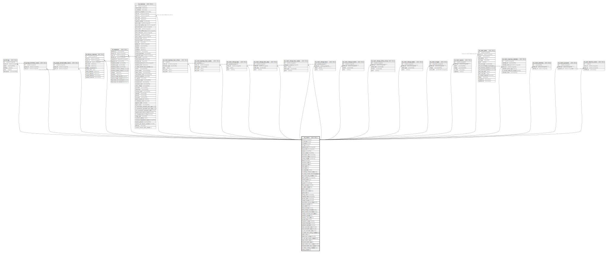

# sk_rooms

## Description

部屋

<details>
<summary><strong>Table Definition</strong></summary>

```sql
CREATE TABLE `sk_rooms` (
  `id` int(11) unsigned NOT NULL AUTO_INCREMENT COMMENT '部屋ID',
  `is_deleted` tinyint(1) DEFAULT '0' COMMENT '削除フラグ',
  `is_public` tinyint(1) NOT NULL DEFAULT '0' COMMENT '公開／非公開フラグ',
  `is_set` tinyint(1) DEFAULT '0' COMMENT '会議室セット',
  `property_id` int(11) unsigned NOT NULL COMMENT '物件ID',
  `lessor_id` int(11) unsigned NOT NULL COMMENT '支店ID',
  `name` varchar(200) NOT NULL DEFAULT '' COMMENT '名前',
  `voice_name` varchar(200) DEFAULT NULL COMMENT '音声読上部屋名',
  `description_url` varchar(1000) DEFAULT NULL COMMENT '詳細URL',
  `exclusive_area` decimal(10,2) DEFAULT NULL,
  `ceiling_height` decimal(10,2) DEFAULT NULL,
  `floor` smallint(5) NOT NULL DEFAULT '1' COMMENT '階数',
  `minimum_time` time DEFAULT NULL COMMENT '最低利用時間',
  `maximum_time` time DEFAULT NULL COMMENT '最大利用時間',
  `start_date` date DEFAULT NULL COMMENT '内覧開始日',
  `end_date` date DEFAULT NULL COMMENT '内覧終了日',
  `is_ninjalock` tinyint(1) NOT NULL DEFAULT '1' COMMENT 'NInjaLock対応施設',
  `is_display_entrance_note` tinyint(1) NOT NULL DEFAULT '1' COMMENT 'ninjalock連携スペースに関して、入退室に関するノートの表示有無',
  `is_using_custom_business_hour` tinyint(1) NOT NULL DEFAULT '0',
  `has_local_area_network` tinyint(1) NOT NULL DEFAULT '0' COMMENT '室内インターネット環境の有無',
  `basic_price` int(11) unsigned DEFAULT '0' COMMENT '基本料金（30分単位）',
  `extend_price` int(11) DEFAULT '0' COMMENT '延長料金',
  `max_price` int(11) DEFAULT '0',
  `memo` varchar(2000) DEFAULT NULL COMMENT '内部メモ',
  `floor_position` smallint(5) NOT NULL DEFAULT '1' COMMENT '1:地上、2:地下、3:屋上',
  `is_tablet_linked` int(11) DEFAULT '0',
  `batch_mail` int(11) DEFAULT '1' COMMENT 'cron処理のメール送信フラグ 0:送信しない、1:送信する',
  `batch_mail_owner` int(11) NOT NULL DEFAULT '0' COMMENT 'オーナーへのメール送信フラグ',
  `guide_text` text COMMENT '紹介文',
  `eating_text` varchar(1000) NOT NULL DEFAULT '' COMMENT '飲食について',
  `cleanup_text` varchar(1000) NOT NULL DEFAULT '' COMMENT '後片付け・ゴミについて',
  `facility_text` varchar(1000) NOT NULL DEFAULT '' COMMENT '設備・サービス',
  `change_layout` smallint(2) NOT NULL DEFAULT '0' COMMENT '室内レイアウト変更 0:レイアウト登録しない 1:利用者が変更 2:オーナーが変更 3:変更不可',
  `reservation_unit_an_hour` tinyint(1) DEFAULT '0' COMMENT '予約単位1時間',
  `payment_period` int(11) DEFAULT '0' COMMENT '支払期限：予約日の〇日後',
  `sort_order` int(11) DEFAULT '0' COMMENT '表示順',
  `allow_tentative` tinyint(1) DEFAULT '1' COMMENT '仮予約を許可するフラグ',
  `allow_change_reserved` tinyint(1) DEFAULT '0' COMMENT '予約の変更を許可するフラグ',
  `allow_extend_reservation` tinyint(1) DEFAULT '1',
  `change_reserved_limit_date` int(11) DEFAULT NULL COMMENT '予約変更可能期間(利用日の〇日前)',
  `tentative_period` int(11) DEFAULT '1' COMMENT '仮予約可能期間',
  `tentative_limit_date` int(11) DEFAULT '0' COMMENT '仮予約期限-予約取得後〇日',
  `include_tax` tinyint(1) DEFAULT '0' COMMENT '利用料に税込み価格を設定',
  `ninjalock_serial` varchar(24) DEFAULT NULL COMMENT 'NinjaLock',
  `created_datetime` timestamp NULL DEFAULT CURRENT_TIMESTAMP,
  `updated_datetime` timestamp NULL DEFAULT CURRENT_TIMESTAMP ON UPDATE CURRENT_TIMESTAMP,
  `start_reservable_time` smallint(3) DEFAULT '0',
  `end_reservable_time` smallint(3) DEFAULT '14',
  `is_set_reservable_time` tinyint(1) DEFAULT '0',
  `is_buffer_time_setting_enabled` tinyint(1) NOT NULL DEFAULT '0',
  `buffer_time` time NOT NULL DEFAULT '00:00:00' COMMENT '予約間の清掃、準備するための時間',
  `buffer_time_control` smallint(3) DEFAULT '1' COMMENT '1:予約の前後 2:予約の前のみ 3:予約の後のみ',
  `is_one_day_rental_enabled` tinyint(1) DEFAULT '0',
  `owner_buffer_time` time NOT NULL DEFAULT '00:00:00' COMMENT 'owner自身が取った予約',
  `external_buffer_time` time NOT NULL DEFAULT '00:00:00' COMMENT 'Googleカレンダー連携によりインポートされる予約',
  `owner_buffer_time_control` smallint(3) DEFAULT '1' COMMENT '1:予約の前後 2:予約の前のみ 3:予約の後のみ',
  `external_buffer_time_control` smallint(3) DEFAULT '1' COMMENT '1:予約の前後 2:予約の前のみ 3:予約の後のみ',
  `is_lottery_setting_enabled` tinyint(1) DEFAULT '0',
  `lottery_period` int(5) DEFAULT NULL,
  PRIMARY KEY (`id`)
) ENGINE=InnoDB AUTO_INCREMENT=[Redacted by tbls] DEFAULT CHARSET=utf8 COMMENT='部屋'
```

</details>

## Columns

| Name | Type | Default | Nullable | Extra Definition | Children | Parents | Comment |
| ---- | ---- | ------- | -------- | ---------------- | -------- | ------- | ------- |
| id | int(11) unsigned |  | false | auto_increment | [sk_fittings](sk_fittings.md) [sk_groups_limitless_rooms](sk_groups_limitless_rooms.md) [sk_groups_unreservable_rooms](sk_groups_unreservable_rooms.md) [sk_lottery_reserves](sk_lottery_reserves.md) [sk_ninjalocks](sk_ninjalocks.md) [sk_reserves](sk_reserves.md) [sk_room_business_hour_others](sk_room_business_hour_others.md) [sk_room_business_hour_weeks](sk_room_business_hour_weeks.md) [sk_room_charge_days](sk_room_charge_days.md) [sk_room_charge_early_days](sk_room_charge_early_days.md) [sk_room_charge_hour_weeks](sk_room_charge_hour_weeks.md) [sk_room_charge_hours](sk_room_charge_hours.md) [sk_room_charge_months](sk_room_charge_months.md) [sk_room_charge_utility_times](sk_room_charge_utility_times.md) [sk_room_charge_weeks](sk_room_charge_weeks.md) [sk_room_images](sk_room_images.md) [sk_room_layouts](sk_room_layouts.md) [sk_room_plans](sk_room_plans.md) [sk_room_reserves_calendars](sk_room_reserves_calendars.md) [sk_rooms_facilities](sk_rooms_facilities.md) [sk_rooms_purposes](sk_rooms_purposes.md) [sk_user_favorite_rooms](sk_user_favorite_rooms.md) |  | 部屋ID |
| is_deleted | tinyint(1) | 0 | true |  |  |  | 削除フラグ |
| is_public | tinyint(1) | 0 | false |  |  |  | 公開／非公開フラグ |
| is_set | tinyint(1) | 0 | true |  |  |  | 会議室セット |
| property_id | int(11) unsigned |  | false |  |  |  | 物件ID |
| lessor_id | int(11) unsigned |  | false |  |  |  | 支店ID |
| name | varchar(200) |  | false |  |  |  | 名前 |
| voice_name | varchar(200) |  | true |  |  |  | 音声読上部屋名 |
| description_url | varchar(1000) |  | true |  |  |  | 詳細URL |
| exclusive_area | decimal(10,2) |  | true |  |  |  |  |
| ceiling_height | decimal(10,2) |  | true |  |  |  |  |
| floor | smallint(5) | 1 | false |  |  |  | 階数 |
| minimum_time | time |  | true |  |  |  | 最低利用時間 |
| maximum_time | time |  | true |  |  |  | 最大利用時間 |
| start_date | date |  | true |  |  |  | 内覧開始日 |
| end_date | date |  | true |  |  |  | 内覧終了日 |
| is_ninjalock | tinyint(1) | 1 | false |  |  |  | NInjaLock対応施設 |
| is_display_entrance_note | tinyint(1) | 1 | false |  |  |  | ninjalock連携スペースに関して、入退室に関するノートの表示有無 |
| is_using_custom_business_hour | tinyint(1) | 0 | false |  |  |  |  |
| has_local_area_network | tinyint(1) | 0 | false |  |  |  | 室内インターネット環境の有無 |
| basic_price | int(11) unsigned | 0 | true |  |  |  | 基本料金（30分単位） |
| extend_price | int(11) | 0 | true |  |  |  | 延長料金 |
| max_price | int(11) | 0 | true |  |  |  |  |
| memo | varchar(2000) |  | true |  |  |  | 内部メモ |
| floor_position | smallint(5) | 1 | false |  |  |  | 1:地上、2:地下、3:屋上 |
| is_tablet_linked | int(11) | 0 | true |  |  |  |  |
| batch_mail | int(11) | 1 | true |  |  |  | cron処理のメール送信フラグ 0:送信しない、1:送信する |
| batch_mail_owner | int(11) | 0 | false |  |  |  | オーナーへのメール送信フラグ |
| guide_text | text |  | true |  |  |  | 紹介文 |
| eating_text | varchar(1000) |  | false |  |  |  | 飲食について |
| cleanup_text | varchar(1000) |  | false |  |  |  | 後片付け・ゴミについて |
| facility_text | varchar(1000) |  | false |  |  |  | 設備・サービス |
| change_layout | smallint(2) | 0 | false |  |  |  | 室内レイアウト変更 0:レイアウト登録しない 1:利用者が変更 2:オーナーが変更 3:変更不可 |
| reservation_unit_an_hour | tinyint(1) | 0 | true |  |  |  | 予約単位1時間 |
| payment_period | int(11) | 0 | true |  |  |  | 支払期限：予約日の〇日後 |
| sort_order | int(11) | 0 | true |  |  |  | 表示順 |
| allow_tentative | tinyint(1) | 1 | true |  |  |  | 仮予約を許可するフラグ |
| allow_change_reserved | tinyint(1) | 0 | true |  |  |  | 予約の変更を許可するフラグ |
| allow_extend_reservation | tinyint(1) | 1 | true |  |  |  |  |
| change_reserved_limit_date | int(11) |  | true |  |  |  | 予約変更可能期間(利用日の〇日前) |
| tentative_period | int(11) | 1 | true |  |  |  | 仮予約可能期間 |
| tentative_limit_date | int(11) | 0 | true |  |  |  | 仮予約期限-予約取得後〇日 |
| include_tax | tinyint(1) | 0 | true |  |  |  | 利用料に税込み価格を設定 |
| ninjalock_serial | varchar(24) |  | true |  |  |  | NinjaLock |
| created_datetime | timestamp | CURRENT_TIMESTAMP | true |  |  |  |  |
| updated_datetime | timestamp | CURRENT_TIMESTAMP | true | on update CURRENT_TIMESTAMP |  |  |  |
| start_reservable_time | smallint(3) | 0 | true |  |  |  |  |
| end_reservable_time | smallint(3) | 14 | true |  |  |  |  |
| is_set_reservable_time | tinyint(1) | 0 | true |  |  |  |  |
| is_buffer_time_setting_enabled | tinyint(1) | 0 | false |  |  |  |  |
| buffer_time | time | 00:00:00 | false |  |  |  | 予約間の清掃、準備するための時間 |
| buffer_time_control | smallint(3) | 1 | true |  |  |  | 1:予約の前後 2:予約の前のみ 3:予約の後のみ |
| is_one_day_rental_enabled | tinyint(1) | 0 | true |  |  |  |  |
| owner_buffer_time | time | 00:00:00 | false |  |  |  | owner自身が取った予約 |
| external_buffer_time | time | 00:00:00 | false |  |  |  | Googleカレンダー連携によりインポートされる予約 |
| owner_buffer_time_control | smallint(3) | 1 | true |  |  |  | 1:予約の前後 2:予約の前のみ 3:予約の後のみ |
| external_buffer_time_control | smallint(3) | 1 | true |  |  |  | 1:予約の前後 2:予約の前のみ 3:予約の後のみ |
| is_lottery_setting_enabled | tinyint(1) | 0 | true |  |  |  |  |
| lottery_period | int(5) |  | true |  |  |  |  |

## Constraints

| Name | Type | Definition |
| ---- | ---- | ---------- |
| PRIMARY | PRIMARY KEY | PRIMARY KEY (id) |

## Indexes

| Name | Definition |
| ---- | ---------- |
| PRIMARY | PRIMARY KEY (id) USING BTREE |

## Relations



---

> Generated by [tbls](https://github.com/k1LoW/tbls)
