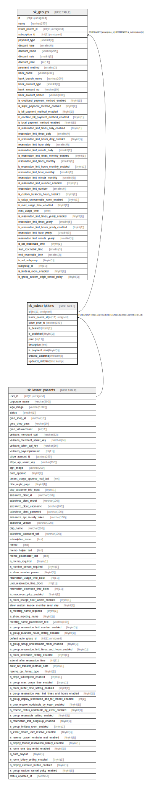

# sk_subscriptions

## Description

<details>
<summary><strong>Table Definition</strong></summary>

```sql
CREATE TABLE `sk_subscriptions` (
  `id` int(11) unsigned NOT NULL AUTO_INCREMENT,
  `lessor_parent_id` int(11) unsigned NOT NULL,
  `stripe_price_id` varchar(255) COLLATE utf8mb4_unicode_ci NOT NULL,
  `is_deleted` tinyint(1) NOT NULL DEFAULT '0',
  `is_published` tinyint(1) NOT NULL DEFAULT '1',
  `price` int(11) NOT NULL,
  `description` text COLLATE utf8mb4_unicode_ci,
  `is_payment_now` tinyint(1) DEFAULT '1',
  `created_datetime` timestamp NULL DEFAULT CURRENT_TIMESTAMP,
  `updated_datetime` timestamp NULL DEFAULT CURRENT_TIMESTAMP ON UPDATE CURRENT_TIMESTAMP,
  PRIMARY KEY (`id`),
  KEY `sk_subscriptions__lessor_parent_id__sk_lessor_parents__id_idx` (`lessor_parent_id`),
  CONSTRAINT `sk_subscriptions__lessor_parent_id__sk_lessor_parents__user_id` FOREIGN KEY (`lessor_parent_id`) REFERENCES `sk_lessor_parents` (`user_id`) ON DELETE CASCADE ON UPDATE CASCADE
) ENGINE=InnoDB AUTO_INCREMENT=[Redacted by tbls] DEFAULT CHARSET=utf8mb4 COLLATE=utf8mb4_unicode_ci
```

</details>

## Columns

| Name | Type | Default | Nullable | Extra Definition | Children | Parents | Comment |
| ---- | ---- | ------- | -------- | ---------------- | -------- | ------- | ------- |
| id | int(11) unsigned |  | false | auto_increment | [sk_groups](sk_groups.md) |  |  |
| lessor_parent_id | int(11) unsigned |  | false |  |  | [sk_lessor_parents](sk_lessor_parents.md) |  |
| stripe_price_id | varchar(255) |  | false |  |  |  |  |
| is_deleted | tinyint(1) | 0 | false |  |  |  |  |
| is_published | tinyint(1) | 1 | false |  |  |  |  |
| price | int(11) |  | false |  |  |  |  |
| description | text |  | true |  |  |  |  |
| is_payment_now | tinyint(1) | 1 | true |  |  |  |  |
| created_datetime | timestamp | CURRENT_TIMESTAMP | true |  |  |  |  |
| updated_datetime | timestamp | CURRENT_TIMESTAMP | true | on update CURRENT_TIMESTAMP |  |  |  |

## Constraints

| Name | Type | Definition |
| ---- | ---- | ---------- |
| PRIMARY | PRIMARY KEY | PRIMARY KEY (id) |
| sk_subscriptions__lessor_parent_id__sk_lessor_parents__user_id | FOREIGN KEY | FOREIGN KEY (lessor_parent_id) REFERENCES sk_lessor_parents (user_id) |

## Indexes

| Name | Definition |
| ---- | ---------- |
| sk_subscriptions__lessor_parent_id__sk_lessor_parents__id_idx | KEY sk_subscriptions__lessor_parent_id__sk_lessor_parents__id_idx (lessor_parent_id) USING BTREE |
| PRIMARY | PRIMARY KEY (id) USING BTREE |

## Relations



---

> Generated by [tbls](https://github.com/k1LoW/tbls)
